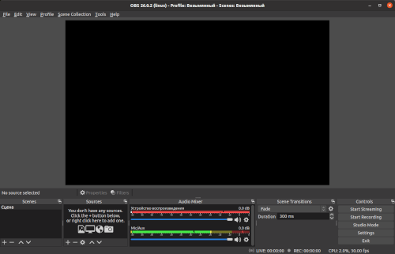
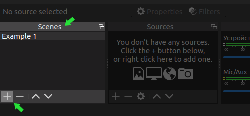
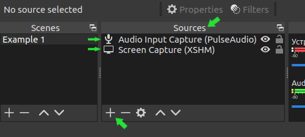
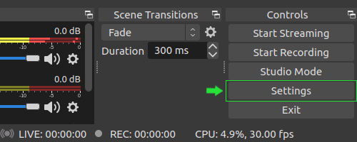
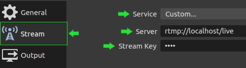

# Set up live streaming with OBS Studio

[Home](../README.md) / setup

### 1. Run OBS Studio

### 2. Scene

In the "Scenes" section add a new scene with an arbitrary name.

### 3. Sources

Click the scene you just created and in the "Sources" section add "Screen Capture (XSHM)" and "Audio Input Capture" items.

### 4. Settings

Click the "Settings" button.

Select the "Stream" item and configure:

- Service: `Custom`
- Server: `rtmp://localhost/live`
- Stream Key: `main`

Click "OK".
